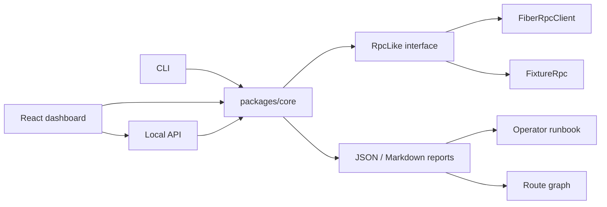

# Fiber Preflight

[](https://github.com/zuhdev/fiber-preflight/actions/workflows/ci.yml)

Fiber Preflight is a payment readiness and route diagnostics toolkit for the Fiber Network. It gives wallets, merchants, and node operators a fast answer before or after a payment attempt:

- Can this invoice be paid from this node right now?
- If not, is the blocker expiry, liquidity, fee policy, graph visibility, or route construction?
- Which fee and MPP settings should a wallet retry with?
- What should the operator do next?

The project ships as a shared TypeScript core, CLI, local HTTP API, and React dashboard with offline demo fixtures for hackathon judging.


## Judge Quick Path

For the fastest hackathon review, start with the submission brief and then run the one-command proof:

- Submission brief: [docs/submission.md](docs/submission.md)
- Demo script: [docs/demo.md](docs/demo.md)
- Live Pudge proof: [docs/testnet-proof.md](docs/testnet-proof.md)
- CI: [GitHub Actions](https://github.com/zuhdev/fiber-preflight/actions/workflows/ci.yml)

```powershell
pnpm install
pnpm judge:proof
```

`pnpm judge:proof` checks or starts the local Fiber proof services, mints a fresh receiver invoice, runs a strict payable live proof, starts the local API/web services when needed, and opens the dashboard with Judge Proof Mode prefilled.

## Why It Matters

Fiber payments can fail for reasons that look similar from the outside: an expired invoice, a missing graph path, insufficient local liquidity, a fee cap that is too low, a channel that cannot carry the whole payment, or a temporary channel failure after execution. Fiber Preflight turns those raw RPC signals into a report, a route graph, and a concrete runbook.

## What It Does

- Runs safe pre-payment checks against Fiber JSON-RPC.
- Hardens live RPC calls with configurable request timeouts and clear connectivity errors.
- Parses invoice facts: amount, expiry, payee, network, and asset hints.
- Inventories peers, ready channels, balances, graph nodes, and graph channels.
- Uses `send_payment` dry-runs to test route availability without sending funds.
- Sweeps fee-rate and MPP part settings in Probe Lab.
- Shows split MPP routes as route graph paths.
- Explains failed payments with postmortem evidence.
- Exports JSON and Markdown reports.
- Keeps recent dashboard reports in local browser history for fast comparison.
- Exports privacy-safe support bundles with raw RPC payloads and secrets redacted.
- Imports support bundles back into the dashboard for redacted report review.
- Generates operator runbooks with owner, priority, and retry params.
- Provides offline fixtures for deterministic demos and CI.

## Packages

| Path | Purpose |
| --- | --- |
| `packages/core` | RPC client, fixtures, diagnostics, failure classifier, reports, runbooks, route probes. |
| `apps/cli` | Terminal interface for checks, probes, status, channels, and postmortems. |
| `apps/api` | Local HTTP API for wallets, merchant services, and web proxy mode. |
| `apps/web` | Vite/React dashboard with demo story mode and route graph visualizer. |
| `fixtures` | Canned scenarios for offline demos and regression tests. |
| `tests` | Node test runner regression suite over the fixture scenarios. |

## Quick Start

```powershell
pnpm install
pnpm check
pnpm test
pnpm build
```

Run the strongest offline demos:

```powershell
pnpm fixture:payable
pnpm fixture:mpp
pnpm fixture:probe
pnpm fixture:postmortem
```

Run the local API and web dashboard:

```powershell
pnpm dev:api
pnpm dev:web
```

Open:

```txt
http://127.0.0.1:5173
```

If that port is busy, Vite may print another localhost port.

## Web Demo

1. Start `pnpm dev:web`.
2. Keep source on `Demo`.
3. Select `MPP needed`.
4. Click `Run story`.
5. Show the Probe Lab result, best setting, runbook, and route graph with `Part 1` and `Part 2`.
6. Select `Failed payment postmortem` and run the story to show post-payment diagnosis.

See [docs/demo.md](docs/demo.md) for a tighter judge-facing script.

## CLI Examples

Live Fiber node:

```powershell
pnpm cli -- check --rpc http://127.0.0.1:8227 --timeout-ms 15000 --invoice fibt1...
pnpm cli -- probe --rpc http://127.0.0.1:8227 --invoice fibt1... --fee-rates 25,50,100 --parts 1,2,4,12
pnpm cli -- explain --rpc http://127.0.0.1:8227 --payment-hash 0x...
pnpm cli -- channels --rpc http://127.0.0.1:8227
pnpm cli -- status --rpc http://127.0.0.1:8227 --invoice fibt1...
pnpm cli -- check --rpc http://127.0.0.1:8227 --invoice fibt1... --bundle
```

## Live Proof Test

Use the live proof runner when you want repeatable evidence that Fiber Preflight works against a real Fiber RPC endpoint. It runs the same core engine as the CLI, API, and dashboard, then writes redacted support bundles to `artifacts/live-proof`.

See [docs/testnet-proof.md](docs/testnet-proof.md) for the current Pudge testnet evidence, including faucet funding transactions, a committed private-channel funding transaction, and a payable invoice dry-run proof.

One-command judge proof, using the local Node A/Node C testnet setup:

```powershell
pnpm judge:proof
```

This checks or starts the local Fiber nodes, mints a fresh receiver invoice, runs `live:proof --probe --expect-payable`, starts the local API/web services when needed, and opens the dashboard with Live RPC proof prefilled. It writes the latest handoff to `artifacts/judge-proof/latest.json`.

Read-only node proof:

```powershell
pnpm live:proof -- --rpc http://127.0.0.1:8227 --timeout-ms 15000
```

Invoice dry-run proof:

```powershell
pnpm live:proof -- --rpc http://127.0.0.1:8227 --invoice fibt1... --probe
```

Strict payable proof, useful when you have a known-good invoice and route:

```powershell
pnpm live:proof -- --rpc http://127.0.0.1:8227 --invoice fibt1... --probe --expect-payable
```

With a Biscuit token:

```powershell
$env:FIBER_PREFLIGHT_TOKEN="your-token"
pnpm live:proof -- --rpc http://127.0.0.1:8227 --invoice fibt1...
```

The runner fails if required live capabilities such as `node_info`, `list_channels`, graph reads, or `parse_invoice` are unavailable. A blocked payment route is still a valid diagnostic result unless `--expect-payable` is set. Generated bundles are privacy-safe by default: raw RPC payloads are omitted and invoices, tokens, secrets, signatures, and long hashes are redacted.

Offline fixtures:

```powershell
pnpm cli -- check --fixture ../../fixtures/expired-invoice.json
pnpm cli -- check --fixture ../../fixtures/mpp-needed.json --markdown
pnpm cli -- probe --fixture ../../fixtures/mpp-needed.json --fee-rates 25,50,100 --parts 1,2,4,12
pnpm cli -- explain --fixture ../../fixtures/failed-payment.json
```

## API

Start the local API:

```powershell
pnpm dev:api
```

Default URL:

```txt
http://127.0.0.1:8787
```

Main endpoints:

- `GET /health`
- `POST /api/preflight/check`
- `POST /api/preflight/explain`
- `POST /api/channels`
- `POST /api/status`
- `POST /api/probes/route`

See [docs/api.md](docs/api.md) for request examples.

## Architecture



More detail: [docs/architecture.md](docs/architecture.md).

## Fixture Scenarios

| Fixture | What it proves |
| --- | --- |
| `payable-route.json` | Healthy node and payable route. |
| `expired-invoice.json` | Invoice expiry blocks payment before route tuning matters. |
| `insufficient-liquidity.json` | Local balance is below the invoice amount. |
| `mpp-needed.json` | Default route fails, but MPP succeeds. |
| `fee-too-low.json` | Liquidity exists, but the fee cap blocks route construction. |
| `failed-payment.json` | Postmortem diagnoses a temporary channel failure. |

## Development

```powershell
pnpm check
pnpm test
pnpm build
```

CI runs the same check, fixture regression, and build sequence on pushes and pull requests.

## Safety Model

Fiber Preflight uses read calls plus `send_payment` with `dry_run` for route simulation. The fixture demos do not require a live node, token, or funds. For live RPC mode, pass a Biscuit token with the minimum read and dry-run permissions needed by your node setup. Live RPC requests default to a 10 second timeout; adjust it with `--timeout-ms`, the API `timeoutMs` field, or the web dashboard live settings.

Use the web `Bundle` export button or CLI `--bundle` flag when sharing diagnostics. Support bundles keep the verdict, evidence, route summary, liquidity lens, and runbook, while omitting raw RPC payloads and redacting invoices, tokens, signatures, secrets, and full hashes. The web dashboard can import a support bundle JSON file or pasted bundle JSON to review the redacted report.
