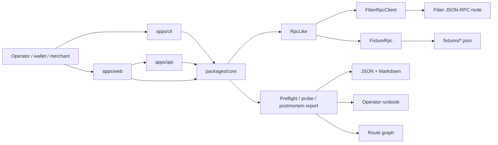
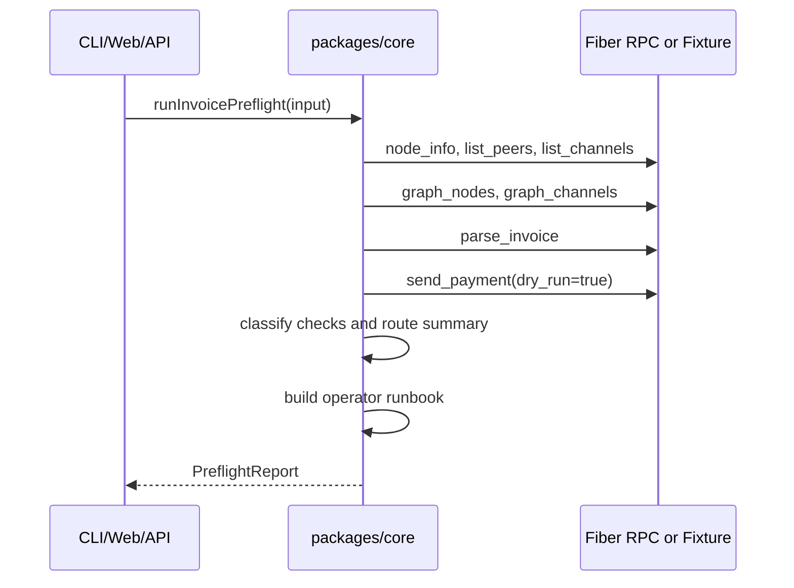

# Architecture

Fiber Preflight is organized around a small core package that accepts an `RpcLike` implementation. This keeps the diagnostics portable across the CLI, local API, web dashboard, fixture tests, and live Fiber RPC.

## System Shape

## Core Modules

| Module | Responsibility |
| --- | --- |
| `rpc.ts` | JSON-RPC client for live Fiber nodes. |
| `fixtures.ts` | Deterministic fixture-backed RPC implementation. |
| `diagnostics.ts` | Invoice preflight and payment postmortem checks. |
| `route-probes.ts` | Fee and MPP dry-run sweeps. |
| `channels.ts` | Channel inventory and liquidity summary. |
| `status.ts` | Node capability and read-permission checks. |
| `failure-classifier.ts` | Maps raw failures to user-facing diagnoses and actions. |
| `runbook.ts` | Converts reports into prioritized operator steps. |
| `report.ts` | Markdown exporters for reports and probe results. |

## Report Flow

## Safety Model

The preflight and probe paths use `send_payment` with `dry_run` to test route construction. The tool is designed to answer "will this likely work and with which settings?" before a wallet sends funds.

For live nodes, the caller supplies:

- RPC URL.
- Optional Biscuit token.
- Invoice or payment hash.
- Optional fee, amount, graph, and MPP limits.

For demos and tests, the caller supplies:

- A fixture scenario.
- No token.
- No live node.

## Route Graph Data

Route summaries preserve two views:

- `hops`: a flat list for compatibility and compact terminal output.
- `paths`: grouped route parts for MPP and graph visualization.

Single-path payments get one `Route` path. Split payments get `Part 1`, `Part 2`, and so on. Each hop can include pubkey, amount, and channel outpoint.

## Extending Fiber Preflight

Good next extension points:

- Add more fixture scenarios from real Fiber failure cases.
- Add stricter timeout and retry controls for live RPC.
- Add API contract tests around `apps/api`.
- Add HTML/PDF report exports for merchant support workflows.
- Add channel-to-route correlation that highlights which local channel caused a route shortfall.
