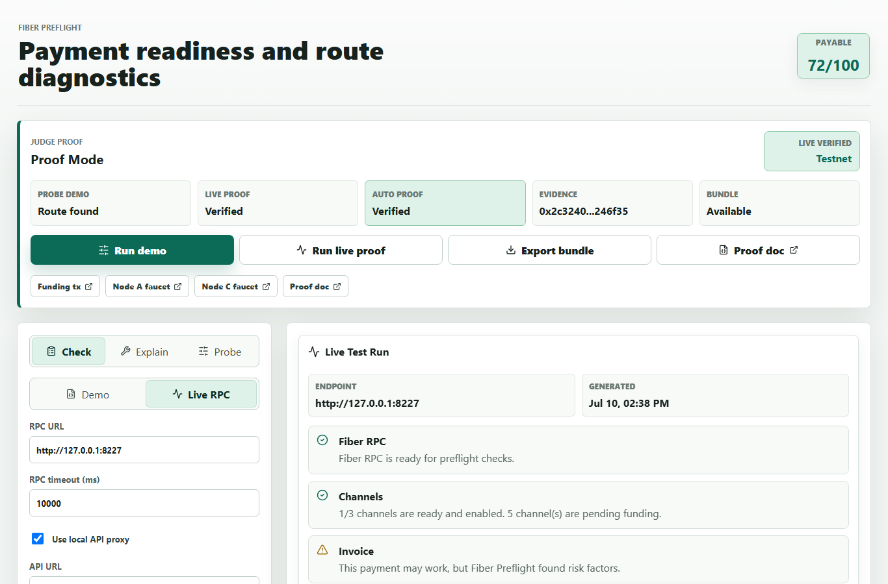
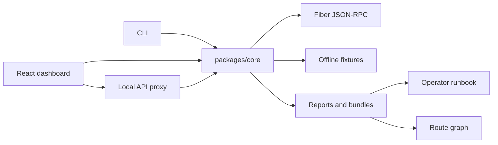

# Fiber Preflight Submission

Fiber Preflight is a payment readiness and route diagnostics toolkit for the Gone in 60ms Fiber Network Infrastructure Hackathon. It helps wallets, merchants, and node operators answer a practical question before they risk a payment attempt:

```txt
Can this Fiber invoice be paid from this node right now, and what should change if it cannot?
```



## Problem

Fiber payment failures can look identical from the outside even when their causes are very different. A user may see a failed payment, while the actual blocker might be an expired invoice, insufficient local liquidity, missing graph visibility, a fee cap that is too low, an MPP requirement, or a temporary channel failure after execution.

Without a focused diagnostic tool, developers waste time reading raw RPC payloads, retrying unsafe guesses, or asking node operators to inspect channels manually.

## Solution

Fiber Preflight turns Fiber RPC state into a clear pre-payment report:

- A readiness score and verdict.
- Invoice facts such as amount, expiry, payee, network, and asset hints.
- Channel and liquidity evidence from the local node.
- Safe `send_payment` dry-runs for route simulation.
- Probe Lab sweeps for fee-rate and MPP settings.
- A route graph showing split payments and hop evidence.
- Operator runbooks with owner, priority, and retry parameters.
- Privacy-safe support bundles for sharing diagnostics.

## What Is Implemented

| Area | Implementation |
| --- | --- |
| Core engine | Shared TypeScript package in `packages/core` for RPC access, fixture replay, diagnostics, probes, reports, support bundles, and runbooks. |
| CLI | `apps/cli` exposes `check`, `probe`, `explain`, `status`, and `channels` commands. |
| API | `apps/api` provides local HTTP endpoints for wallets, merchant services, and the dashboard. |
| Dashboard | `apps/web` provides demo mode, live RPC mode, route graphs, Probe Lab, runbooks, history, and support bundle import/export. |
| Live proof | `pnpm judge:proof` runs the real Fiber testnet proof path and opens the dashboard with proof state prefilled. |
| CI coverage | Fixture, RPC client, API contract, support bundle, dashboard history, browser smoke, type-check, and build tests run in GitHub Actions. |

## Judge Quick Path

Use this when the local Fiber testnet nodes are available:

```powershell
pnpm install
pnpm judge:proof
```

The command checks or starts the local proof services, mints a fresh receiver invoice, runs a strict payable live proof, starts the API and web dashboard when needed, and opens the dashboard in Judge Proof Mode.

For deterministic offline judging:

```powershell
pnpm install
pnpm check
pnpm test
pnpm dev:web
```

Then open the Vite URL, keep source on `Demo`, choose `MPP needed`, and click `Run story`.

## Live Testnet Evidence

The project includes live Pudge testnet proof in [docs/testnet-proof.md](testnet-proof.md). The honest claim is:

- Fiber Preflight ran against real local Fiber RPC endpoints.
- Node A and Node C were funded by committed Pudge faucet transactions.
- A private two-node Fiber channel reached `ChannelReady` on both nodes.
- A committed Fiber channel funding transaction exists on Pudge.
- A generated receiver invoice was checked by Fiber Preflight.
- The route probe found a payable dry-run route over the ready channel.
- Earlier failed public channel attempts were classified instead of hidden.

Key evidence:

```txt
Node A faucet tx: 0x9b4e9543f18d940bc1e9e6f9a86f16bd5a1024d58f02c1400f204b0c2ed351c6
Node C faucet tx: 0xe552573531d457a65616ea7cde64c21dbf580a8c98caf17396f17632d36e432f
Channel funding tx: 0x2c3240e3d8592c1ef959c7008a4b3f5b5253a4de9d3dd075b3ed79a24f246f35
Channel id: 0xb03c6afeef30227de285309c9c4fc968eb1467f3818bec81211b15f12437dbfb
```

The proof is intentionally safe: it uses live reads and dry-run route simulation, not a real outgoing payment.

## Architecture



The core package is intentionally reusable so a wallet, merchant backend, explorer tool, or operator dashboard can embed the same diagnostic engine.

## Safety And Privacy

Fiber Preflight avoids unsafe trial-and-error payments by using read calls and `send_payment` dry-runs where supported. Support bundles redact invoices, tokens, secrets, signatures, and long hashes, and they omit raw RPC payloads by default.

For live deployments, use a Biscuit token with the minimum read and dry-run permissions required by the node setup.

## Known Limits

- The live proof uses local Pudge testnet nodes and a private two-node channel, not mainnet funds.
- Public channel attempts may remain in `NegotiatingFunding`; Fiber Preflight treats those channels as unusable until they are funded and ready.
- A private-channel dry-run can be payable even when graph visibility warnings remain, so the UI intentionally shows both the payable route and the cautionary evidence.

## Repo Map

| File | Why judges should open it |
| --- | --- |
| [README.md](../README.md) | Product overview, install path, live proof commands, API summary. |
| [docs/demo.md](demo.md) | Short judging script. |
| [docs/testnet-proof.md](testnet-proof.md) | Detailed live Pudge proof with transaction hashes. |
| [docs/architecture.md](architecture.md) | System design and data flow. |
| [docs/api.md](api.md) | Local HTTP API examples. |
| [tests/fixture-regression.test.ts](../tests/fixture-regression.test.ts) | Regression tests for diagnostic scenarios. |
